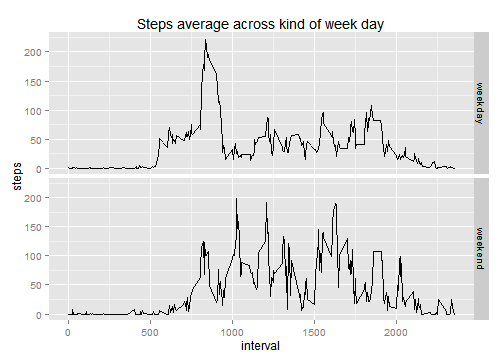

## Loading and preprocessing the data

We will just load the data and keep it as is. An additional pre-processing is not required.


```r
activity.df <- read.csv('activity.csv')
# An additional pre-processing is not required.
```


## I. What is mean total number of steps taken per day?

### 1. Calculate the total number of steps taken per day


```r
library(dplyr, warn.conflicts = FALSE, quietly = TRUE)
total.steps.per.day.df <-
  subset(activity.df, !is.na(steps)) %>%
  group_by(date) %>%
  summarize(total.steps = sum(steps))
```

### 2. Plot the steps histogram


```r
library(ggplot2)
ggplot(total.steps.per.day.df) +
  ggtitle('Total number of steps taken each day') +
  geom_histogram(aes(total.steps), binwidth=250, fill='gray', color='darkgreen')
```

 

### 3. Calculate the mean and median of steps taken per day


```r
mean.steps.per.day <- mean(total.steps.per.day.df$total.steps)
median.steps.per.day <- round(median(total.steps.per.day.df$total.steps))

cat('mean of steps per day:', mean.steps.per.day)
```

```
#> mean of steps per day: 10766
```

```r
cat('median of steps per day:', median.steps.per.day)
```

```
#> median of steps per day: 10765
```

The mean of steps per day is **10766.2**.
The median of steps per day is **10765**.

## II. What is the average daily activity pattern?

### 1. Plot average number of steps per interval, averaged across all days


```r
mean.steps.per.interval.df <-
  subset(activity.df, !is.na(steps)) %>%
  group_by(interval) %>%
  summarize(mean.steps = mean(steps))

ggplot(mean.steps.per.interval.df) +
  ggtitle('Number of steps averaged across all days') +
  geom_line(aes(interval, mean.steps))
```

 

### 2. Which 5-minute interval, contains the maximum number of steps?


```r
max.mean.steps <- max(mean.steps.per.interval.df$mean.steps)
case.max.mean.steps <- subset(mean.steps.per.interval.df, mean.steps == max.mean.steps)
cat('Interval with max average steps:', case.max.mean.steps$interval)
```

```
#> Interval with max average steps: 835
```

The 5-minute interval, on average across all the days in the dataset, containing the maximum number of steps is **835**.

## III. Imputing missing values

### 1. Calculate and report the total number of rows with NAs.


```r
number.of.nas <- sum(is.na(activity.df))
cat('The number of row with NAs is', number.of.nas)
```

```
#> The number of row with NAs is 2304
```

The number of row with NAs is **2304**.

### 2. Devise a strategy for filling in all of the missing values in the dataset.

I will replace the NA values in the steps variable with the median number of steps in the same interval computed along all days. If there is no data for given interval which just have NA values, we will use the overall median value along all the intervals in the data set.

### 3. Create dataset equal to the original one with the missing data filled in

I will create the new.activity.df data set with the missing steps filled using the startegy described above.


```r
new.activity.df <- activity.df

# Compute the median steps per date (ignoring the NA cases)
median.steps.per.interval.df <-
  subset(activity.df, !is.na(steps)) %>%
  group_by(interval) %>%
  summarize(steps = median(steps))

# Overall median steps per interval
median.steps.per.interval <- median(median.steps.per.interval.df$steps)

# For each row in the activity data table:
for (row.index in 1:nrow(new.activity.df)) {
  # Read the current row
  row <- new.activity.df[row.index,]
  # If the row has a NA value
  if (is.na(row$steps)) {
    # Find row with the same date in median.steps.per.day.df table
    median.steps.row <- subset(median.steps.per.interval.df, interval == row$interval)
    # If no row was found...
    median.steps <-
      # ... use the total median per day...
      if (nrow(median.steps.row) == 0) median.steps.per.interval
      # ...otherwise, use the median for that day
      else median.steps.row$steps

    # Replace the NA value in the current row
    new.activity.df[row.index,'steps'] <- median.steps
  }
}
```

#### 4.1. Plot a  Histogram of the total number of steps taken each day.


```r
new.total.steps.per.day.df <-
  subset(new.activity.df) %>%
  group_by(date) %>%
  summarize(total.steps = sum(steps))

ggplot(new.total.steps.per.day.df) +  
  ggtitle('Total number of steps taken each day') +
  geom_histogram(aes(total.steps), binwidth=250, fill='gray', color='darkgreen')
```

 


#### 4.2. Calculate and report the mean and median total number of steps taken per day


```r
new.mean.steps.per.day <- mean(new.total.steps.per.day.df$total.steps)
new.median.steps.per.day <- median(new.total.steps.per.day.df$total.steps)

cat('The (new) mean of steps per day is:', new.mean.steps.per.day)
```

```
#> The (new) mean of steps per day is: 9504
```

```r
cat('The (new) median of steps per day is:', new.median.steps.per.day)
```

```
#> The (new) median of steps per day is: 10395
```

The new mean of steps per day is **9503.9**.
The new median of steps per day is **10395**.

### 4.3 Do these values differ from the estimates from the first part of the assignment?

The histogram has changed, with an added new second bar with values that in the original data set were NA.

They differ, in the fisrt part of this assignment we got a mean of **10766.2**.
and a median of **10765**. 

The impact caused by imputing missing data is a difference of **1262.3** in the mean of steps per day and **370** in the median of steps per day. The impact is smaller in the median value because we have replaced the NANs with interval median values along all days.

## IV. Are there differences in activity patterns between weekdays and weekends?

### 1. Create a new factor variable in the dataset with two levels


```r
week.day <- weekdays(as.Date(activity.df$date))
weekends <- week.day == 'sábado' | week.day == 'domingo'
week.day[weekends] <- 'weekend'
week.day[!weekends] <- 'weekday'
activity.df$weekday.kind <- as.factor(week.day)
```

### 2. Plot the interval and the steps average across weekday/weekend days


```r
mean.steps.df <-
  subset(activity.df, !is.na(steps)) %>%
  group_by(weekday.kind, interval) %>%
  summarize(steps = mean(steps))

ggplot(mean.steps.df, aes(interval, steps)) +
  ggtitle('Steps average across kind of week day') +
  geom_line() +
  facet_grid(weekday.kind ~ .)
```

 

End of Report.
